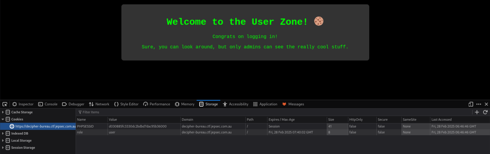
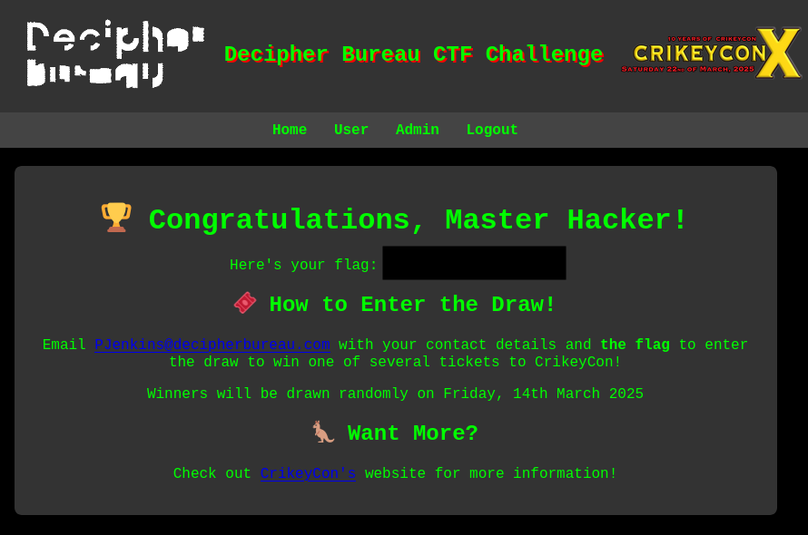

# decipher-bureau.ctf.jepsec.com.au

## Intro
* Experienced BA with ancient dev skills tackles the CTF at http://decipher-bureau.ctf.jepsec.com.au, which is generously provided by the nice people at cybersec recruitment agency [Decipher Bureau](https://www.decipherbureau.com/) (with [Jepsec](jepsec.com.au) doing a CTF-as-a-service under the hood). 
* I'm attempting the CTF for the opportunity to develop cyber skills as I'm (slowly) transitioning into a less boring day job. I've already bought my ticket to [CrikeyCon](https://crikeycon.com/) so if I'm offered one I'll donate to someone else.

## Start
From http://decipher-bureau.ctf.jepsec.com.au ($target)

So _Crawlers avoid the obscure, but they can unearth hidden treasures...._ encourages me to see if I can find content on the site that doesn't appear via the browser. 

1. **wget $target/robots.txt** finds a robots.txt file containing:

        User-agent: *
        Disallow: /webadmin.php

    Not indexing $target/webadmin.php sure looks interesting...

    
    
    And a login button...

    

    Which contains:

    

2. At this point I did the following:
    * Tried a few of the "classic" username/password combinations via a browser (no joy):
        - admin/admin
        - admin/password
        - root/root
        - root/password
    * Looked at HTML source for hints (none).
    * Did some more recon looking for anything interesting:
       - nslookup (2 IP addresses)
       - sslyze
    * Got a little over-excited and ran some brute force/scanning tools, which didn't help me make progress but were outside the CTF rules. My bad (see earlier comment about n00b-ness):
        - dirb 
        - nmap 
    * Spent a bunch of time getting burpsuite to work on a Kali VM running in VMWare Fusion on m4 MacBook Pro. This was very annoying... because Java.
    * Once burpsuite was running I proxied those username/password combinations with the same result. 
    * [OWASP Top Ten 2025](https://owasp.org/www-project-top-ten/) provides a prioritised list of ideas for next steps. Given I was already submitting username/password combinations, why not try some SQL injection ([A03:2021 – Injection](https://owasp.org/Top10/A03_2021-Injection/)):
        - username/password `admin' --`/admin (rejected)
        - username `\'--` with no password (success)
    
    

    Cool.

3. Really cool stuff
    * I have bypassed auth by exploiting SQL injection and am told I now need to log in as an admin. There's also a bug hint... a cookie image.
    * Using Firefox's inspector, I notice the app sends a cookie containing `role:user`:
   
    

    * So what if we just fiddle with the cookie and give this session a cookie containing `role:admin` ([A01:2021 – Broken Access Control](https://owasp.org/Top10/A01_2021-Broken_Access_Control/)). Surely that's too simple... 

    

    Nope. 

## Summary
A CTF so simple even a n00b could crack it ;-) Thanks to the organisers for the good clean fun.
